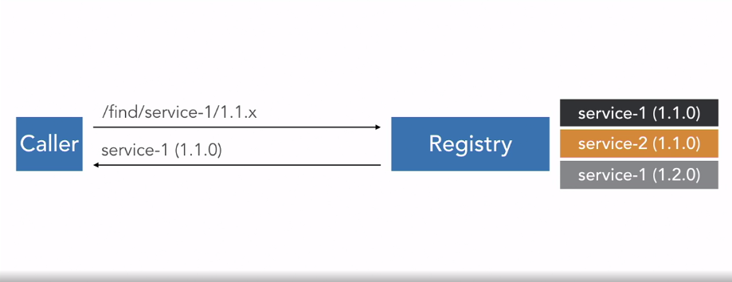
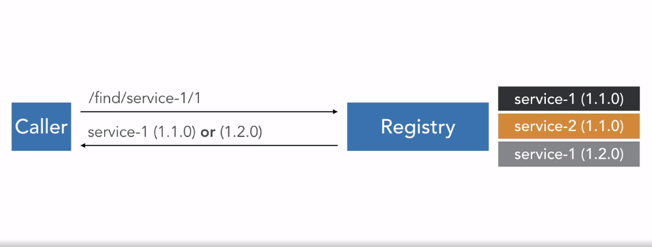
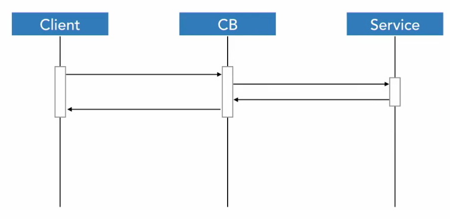
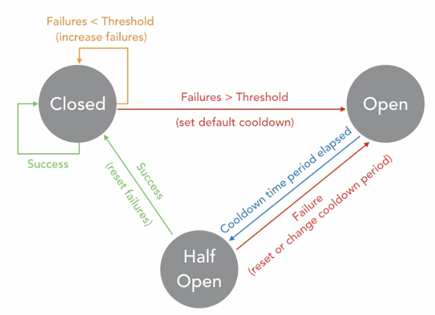

# nodejs-micro-services

This is a app ([conference-app](https://github.com/laissonsilveira/nodejs-micro-services/tree/main/conference-app)) sample to microservices with NodeJS.

Here receive the requests and call the services regitered.

## Service Registry

Project: [service-registry](https://github.com/laissonsilveira/nodejs-micro-services/tree/main/service-registry)

To register: `PUT|DELETE /register/:servicename/:serviceversion/:serviceport`

To use service: `GET /find/:servicename/:serviceversion`

Return service data:
```js
{
    "timestamp": 1552334467,
    "ip": "[::1]",
    "port": "3009",
    "name": "service-1",
    "version": "1.2.0",
}
```
or
```js
{
    "result": "Service not found"
}
```

The service [expire](https://github.com/laissonsilveira/nodejs-micro-services/tree/main/service-registry/server/lib/ServiceRegistry.js#L7).

### Version



### Load Balancing



## Microservices

Project: [feedback-service](https://github.com/laissonsilveira/nodejs-micro-services/tree/main/feedback-service)

Project: [speakers-service](https://github.com/laissonsilveira/nodejs-micro-services/tree/main/speakers-service)

### Services Server on listening

`PUT <SERVICE-REGISTRY-HOST>/register/${config.name}/${config.version}/${server.address().port}`

### Services on ERROR/SIGN TERM/BY INTERVAL/ETC

`DELETE <SERVICE-REGISTRY-HOST>/register/${config.name}/${config.version}/${server.address().port}`

## Tolerance and Resilience

### [Circuit Break](https://github.com/laissonsilveira/nodejs-micro-services/tree/main/conference-app/server/lib/CircuitBreaker.js)

* Closed State



* Circuit Break Control



* Cache and Cache Images (key = requestMethod + requestURL)

* [SpeakersService](https://github.com/laissonsilveira/nodejs-micro-services/tree/main/conference-app/server/services/Speakers.js#L78)

## Queues

This example use the [RabbitMQ](https://www.rabbitmq.com)

* Install server: `brew install rabbitmq`
* Install client: `npm i ampqlib`

### Queuing

* addEntry()s: [FeedbackService](https://github.com/laissonsilveira/nodejs-micro-services/tree/main/conference-app/server/services/Feedback.js#L18)

### Consuming and Store

* [Consuming](https://github.com/laissonsilveira/nodejs-micro-services/tree/main/feedback-service/server/service.js#L15)
* [Store](https://github.com/laissonsilveira/nodejs-micro-services/tree/main/feedback-service/server/service.js#L20)
